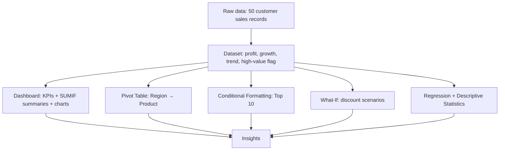

# Sales Analyzer — Excel Project 2

**Dashboards, Pivot Tables, What-If Scenarios & Regression in Microsoft Excel**

Created by **Vaidehi Vyas**


> *Raw sales rows are just noise until a formula, a pivot, or a chart gives them a voice.*

| 8 | 50 | ₹10,48,150 | 4 | 3 |
|:-:|:-:|:-:|:-:|:-:|
| Worksheets | Customer records | Total sales | Regions | Dashboard charts |

---

## Table of Contents

1. [Overview](#overview)
2. [Problem Statement](#problem-statement)
3. [Key Features](#key-features)
4. [Project Structure](#project-structure)
5. [Project Workflow](#project-workflow)
6. [Part A — Dataset: Formulas & Calculated Columns](#part-a--dataset-formulas--calculated-columns)
7. [Part B — Dashboard: KPIs & Charts](#part-b--dashboard-kpis--charts)
8. [Part C — Pivot Table & Conditional Formatting](#part-c--pivot-table--conditional-formatting)
9. [Part D — What-If Analysis](#part-d--what-if-analysis)
10. [Part E — Regression & Descriptive Statistics](#part-e--regression--descriptive-statistics)
11. [Tech Stack](#tech-stack)
12. [Results & Insights](#results--insights)
13. [Known Quirks & Fixes](#known-quirks--fixes)
14. [Advantages](#advantages)
15. [License](#license)
16. [Author](#author)
17. [Acknowledgements](#acknowledgements)

---

## Overview

**Sales Analyzer** is a hands-on **Microsoft Excel** workbook (`PROJECT_2_EXCEL.xlsx`) built around one idea: a sales table becomes useful once it can **summarize itself, highlight what matters, and answer "what if?"**. Across eight worksheets, the workbook takes 50 customer sales records and turns them into KPIs, charts, pivots, scenarios, and a statistical model.

This project is designed to:

- Add **calculated columns** for profit, monthly growth, trend arrows, and high-value customers
- Build a **Dashboard** with live KPIs and three charts driven by `SUMIF`
- Summarize data by region and product with a **Pivot Table**
- Highlight top performers using **Conditional Formatting** (Top 10 rule and icon sets)
- Test discount scenarios with a **What-If Analysis** table
- Measure the Sales → Profit relationship with **Regression** and **Descriptive Statistics** from the Data Analysis ToolPak

---

## Problem Statement

> **Objective:** Given a plain list of customers, regions, products, sales amounts, and discounts, use Excel's built-in tools to calculate profit, summarize performance, flag top customers, test discount scenarios, and measure how sales relate to profit — without macros.

The raw data looks like everyday business records: who bought what, where, for how much, and at what discount. The task is to let Excel do the analysis.

| Sheet | Type | Description |
|-------|------|-------------|
| `Dashboard` | Report | KPI cards, region / customer / product summaries, 3 charts |
| `Pivot Table` | Summary | Sum of sales by Region → Product, with a bar chart |
| `Dataset` | Data + formulas | 50 records with 5 calculated columns and a line chart |
| `Conditional Formatting` | Demo | Top-10 highlighting on customer sales |
| `What-If Analysis` | Scenario | Sales total at 0%–20% discount |
| `Regression` | Input | Sales vs. Profit pairs (10 observations) |
| `Regression Output` | Output | Full ToolPak regression summary and ANOVA |
| `Descriptive Statistics - Sales` | Output | Mean, median, mode, variance, skewness, and more |

---

## Key Features

| Feature | Description |
|---------|-------------|
| **Eight Themed Worksheets** | Each sheet isolates one analysis technique so it can be studied on its own |
| **Live KPI Cards** | Total Sales, Total Profit, Average Sales, and Customer Records update automatically |
| **Region / Customer / Product Summaries** | `SUMIF` tables feed a column chart, a line chart, and a pie chart |
| **Trend Arrows** | `↑ ↓ →` computed from month-over-month growth, plus an icon-set rule |
| **High-Value Customer Flag** | `LARGE` + `INDEX` + `MATCH` picks out the top 10 sales |
| **Top-10 Highlighting** | Conditional formatting on `Dataset!E2:E51` and the demo sheet |
| **Pivot Summary** | Region → Product breakdown with a Grand Total of ₹10,48,150 |
| **Discount Scenarios** | Five discount levels (0%, 5%, 10%, 15%, 20%) compared side by side |
| **Statistical Modeling** | Regression (R² = 0.733) and descriptive statistics on sales |

---

## Project Structure

```
excel-sales-analyzer/
│
├── PROJECT_2_EXCEL.xlsx            Main workbook (8 worksheets)
│   ├── Dashboard                   KPIs, SUMIF tables, 3 charts
│   ├── Pivot Table                 Region → Product sales + bar chart
│   ├── Dataset                     50 records, calculated columns, line chart
│   ├── Conditional Formatting      Top-10 highlighting demo
│   ├── What-If Analysis            Discount scenario table
│   ├── Regression                  Sales vs. Profit input data
│   ├── Regression Output           ToolPak regression summary
│   └── Descriptive Statistics      Sales summary statistics
│
└── README.md                       Project documentation
```

---

## Project Workflow



---

## Part A — Dataset: Formulas & Calculated Columns

The `Dataset` sheet holds **50 customer records** (IDs `101`–`150`) in columns `A:K`, with formulas in columns `G`, `H`, `I`, `J`, and `K`.

| Column | Name | Formula |
|:------:|------|---------|
| G | profit | `=E2*(1-F2)` |
| H | Monthly sales growth | `=IFERROR((E3-E2)/E2,0)` |
| I | Timestamp | `=NOW()` |
| J | Monthly Sales Trend | `=IF(H2>0,"↑",IF(H2<0,"↓","→"))` |
| K | High value customer | `=IF(E2>=LARGE($E$2:$E$51,10),INDEX($B$2:$B$51,MATCH(E2,$E$2:$E$51,0)),"")` |

Sample rows:

| ID | Customer | Region | Product | Sales | Discount | Profit | Growth | Trend |
|---:|----------|--------|---------|------:|---------:|-------:|-------:|:-----:|
| 104 | Megha | East | ac | 56,000 | 20% | 44,800 | 0.0% | → |
| 103 | Jayesh | South | fridge | 55,000 | 20% | 44,000 | −1.8% | ↓ |
| 105 | Om | South | smartwatch | 45,600 | 40% | 27,360 | −17.1% | ↓ |
| 101 | Vaidehi | North | laptop | 45,000 | 50% | 22,500 | −1.3% | ↓ |
| 106 | Ranjan | West | mobile | 34,500 | 34% | 22,770 | −23.3% | ↓ |

> [!NOTE]
> Rows are sorted by sales in descending order, so "monthly growth" compares each row with the one above it. Of the 50 rows, **43 show ↓** and **7 show →**.

---

## Part B — Dashboard: KPIs & Charts

The `Dashboard` sheet pulls everything from `Dataset` using `SUM`, `AVERAGE`, `COUNTA`, and `SUMIF`.

### KPI Cards

| KPI | Formula | Value |
|-----|---------|------:|
| Total Sales | `=SUM(Dataset!E2:E51)` | **10,48,150** |
| Total Profit | `=SUM(Dataset!G2:G51)` | **8,03,310.5** |
| Average Sales | `=AVERAGE(Dataset!E2:E51)` | **20,963** |
| Customer Records | `=COUNTA(Dataset!B2:B51)` | **50** |

### Summary Tables & Charts

```excel
=SUMIF(Dataset!$C$2:$C$51, A10, Dataset!$E$2:$E$51)     ← sales by region
=SUMIF(Dataset!$D$2:$D$51, G10, Dataset!$E$2:$E$51)     ← sales by product
```

| Summary | Source | Chart |
|---------|--------|-------|
| Sales by Region (4 rows) | `A9:B13` | Column chart |
| Top 10 Customers | `D9:E19` | Line chart |
| Top 10 Products | `G9:H19` | Pie chart |

| Region | Total Sales | Share |
|--------|------------:|------:|
| South | 3,28,850 | 31.4% |
| West | 2,88,900 | 27.6% |
| North | 2,29,500 | 21.9% |
| East | 2,00,900 | 19.2% |

---

## Part C — Pivot Table & Conditional Formatting

### Pivot Table

The `Pivot Table` sheet shows **Sum of sales** with rows grouped as **Region → Product**, plus a bar chart.

| Row Label | Sum of sales |
|-----------|-------------:|
| East | 2,00,900 |
| North | 2,29,500 |
| South | 3,28,850 |
| West | 2,88,900 |
| **Grand Total** | **10,48,150** |

Totals match the `SUMIF` tables on the Dashboard exactly.

### Conditional Formatting

| Where | Rule | Purpose |
|-------|------|---------|
| `Dataset!E2:E51` | Top 10 | Highlights the 10 biggest sales |
| `Dataset!H2:H51` | Icon set | Visual arrows for growth |
| `Conditional Formatting!B2:B11` | Top 10 rules | Standalone demo on a small customer list |

---

## Part D — What-If Analysis

The `What-If Analysis` sheet applies a scenario discount to total sales.

```excel
=SUM(Dataset!$E$2:$E$51)*(1-A2)
```

| Discount | Result |
|:--------:|-------:|
| 0% | 10,48,150 |
| 5% | 9,95,742.5 |
| 10% | 9,43,335 |
| 15% | 8,90,927.5 |
| 20% | 8,38,520 |

Each 5-point step in discount removes about **₹52,407** from the total.

---

## Part E — Regression & Descriptive Statistics

### Regression (Sales → Profit)

Ten sales/profit pairs were analyzed with the Data Analysis ToolPak.

| Statistic | Value |
|-----------|------:|
| Multiple R | 0.8562 |
| R Square | 0.7332 |
| Adjusted R Square | 0.6998 |
| Standard Error | 6,709.69 |
| Observations | 10 |
| Slope (Sales coefficient) | 0.8943 |
| Slope p-value | 0.0016 |
| Intercept | −11,372.78 |
| Significance F | 0.0016 |

> [!TIP]
> The p-value is well below 0.05, so the Sales → Profit relationship is **statistically significant**. About **73%** of the variation in profit is explained by sales.

### Descriptive Statistics — Sales (10 values)

| Measure | Value | Measure | Value |
|---------|------:|---------|------:|
| Mean | 39,400 | Minimum | 23,000 |
| Median | 39,750 | Maximum | 56,000 |
| Mode | 45,000 | Range | 33,000 |
| Std. Deviation | 11,724.71 | Sum | 3,94,000 |
| Sample Variance | 13,74,68,888.89 | Count | 10 |
| Skewness | 0.0125 | Kurtosis | −1.1853 |

Mean and median are nearly equal and skewness is close to zero, so the sales values are almost symmetric.

---

## Tech Stack

| Tool | Purpose |
|------|---------|
| **Microsoft Excel 365 / 2021+** | Spreadsheet engine |
| **Formulas** | `SUM`, `AVERAGE`, `COUNTA`, `SUMIF`, `IF`, `IFERROR`, `LARGE`, `INDEX`, `MATCH`, `NOW` |
| **PivotTable & PivotChart** | Region → Product summary |
| **Conditional Formatting** | Top-10 rule, icon sets |
| **Charts** | Column, line, pie, bar |
| **What-If Analysis** | Scenario-based discount table |
| **Data Analysis ToolPak** | Regression and Descriptive Statistics |

---

## Results & Insights

- **₹10,48,150** total sales across 50 customers, with an average of **₹20,963** per record
- **South** is the strongest region at **31.4%** of sales; **East** is the weakest at **19.2%**
- The **top 10 sales** add up to ₹4,09,100, or about **39%** of the total
- **Megha (₹56,000, `ac`)** and **Jayesh (₹55,000, `fridge`)** are the top two customers
- Discounts range from **5% to 67%**, averaging **19%**
- A 20% blanket discount would lower the total to **₹8,38,520**
- Sales explain about **73%** of profit variation (R² = 0.733, p = 0.0016)

---

## Known Quirks & Fixes

A few spots in the workbook behave unexpectedly. They are documented here as fixes or debugging exercises.

| Sheet | Cell(s) | Issue | Suggested Fix |
|-------|---------|-------|---------------|
| Dataset | `G2:G51` | "profit" is calculated as `Sales × (1 − Discount)`, which is really the **post-discount revenue**, not profit | Rename the column to *Net Sales*, or subtract a cost column |
| Dataset | `K2:K51` | `MATCH` returns the first matching sales value, so ties show the wrong name (Vijaya's row shows *Vaidehi*, Hetvi's row shows *Shankar*) | Use the customer name in the same row: `=IF(E2>=LARGE($E$2:$E$51,10),B2,"")` |
| Dataset | `I2:I51` | `NOW()` is volatile and changes on every recalculation | Enter a fixed date, or use `Ctrl + ;` |
| Dataset | `H2:H51` | Growth compares each row with the previous row, but data is sorted by sales, not time | Add a Month column and sort by it |
| Dataset | `C` | Region has mixed case (`south`, `east`) | Retype or wrap with `PROPER()` |
| Dataset | `D` | Typos and duplicates (`bluetuth`, `speckar`, `air pode`, `washing machine` vs `Washing Machine`) | Clean the product names |
| What-If Analysis | `B1` | Header says "Total Profit" but formulas use total **sales** | Rename the header, or base it on column `G` |
| Dataset / Dashboard | headers | `Customber` is misspelled | Correct to `Customer` |

---

## Advantages

| Advantage | Detail |
|-----------|--------|
| **End-to-End Workflow** | Goes from raw data to dashboard to statistical model |
| **Formula-Driven** | KPIs and charts refresh automatically when data changes |
| **Cross-Checked** | Pivot totals match the `SUMIF` dashboard totals |
| **Beginner Friendly** | One sheet per technique keeps navigation simple |
| **No Macros or Add-ins** | Only the built-in Data Analysis ToolPak is needed |
| **Extensible** | Easy to add slicers, `XLOOKUP`, forecasting, or Power Query sheets |

---

## License

This project is licensed under the **MIT License**.

```
MIT License — Free to use, modify, and distribute with attribution.
```

---

## Author

**Vaidehi Vyas**
Excel & Data Analytics Learner · India

[](https://github.com/)
[](https://www.linkedin.com/)

**Skills:** Excel · Dashboards · Pivot Tables · What-If Analysis · Regression · Data Cleaning

---

## Acknowledgements

- [Microsoft Excel Support](https://support.microsoft.com/excel) — Official function reference
- [ExcelJet](https://exceljet.net/) — Clear formula examples
- [Chandoo.org](https://chandoo.org/) — Dashboard and chart tutorials
- [W3Schools Excel](https://www.w3schools.com/excel/) — Beginner-friendly reference
- [Stack Overflow](https://stackoverflow.com/) — Problem-solving support

---

*Made by **Vaidehi Vyas** — If this project helped you, consider giving it a ⭐ — Last updated: 09 October 2026*
